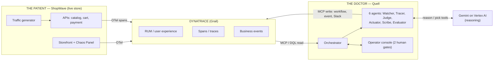
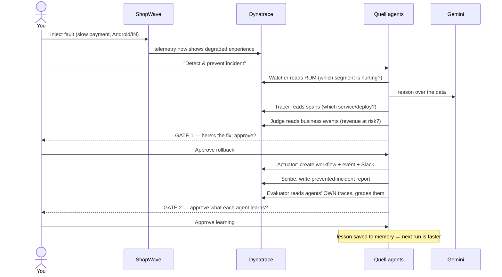
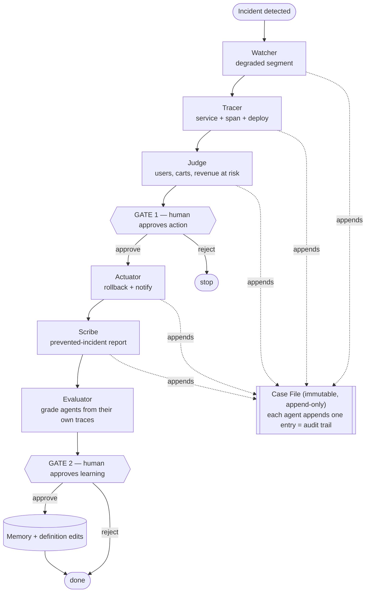
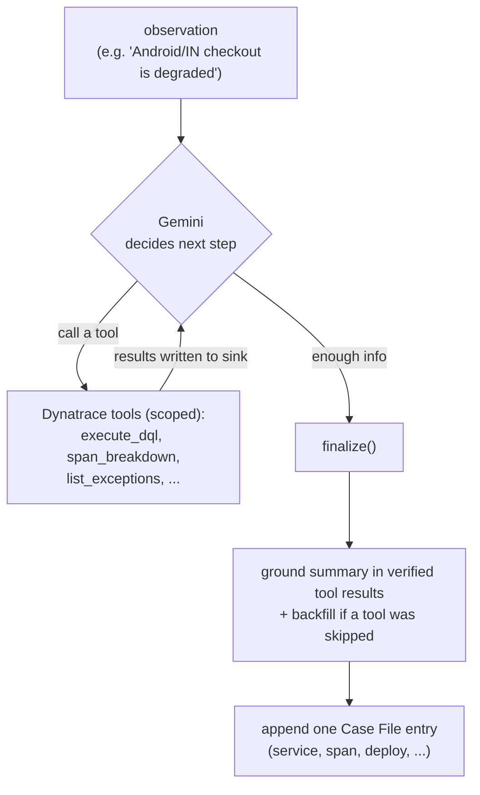
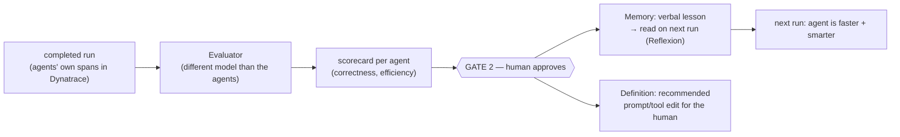
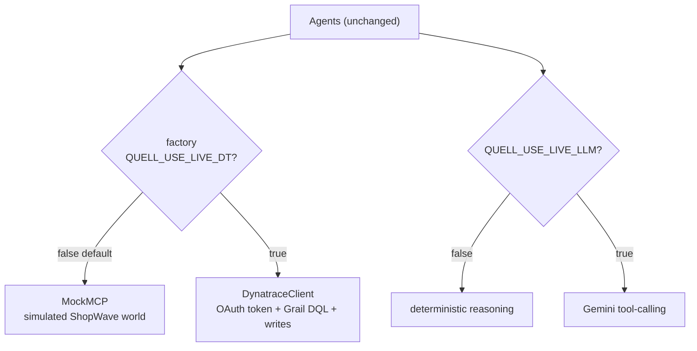
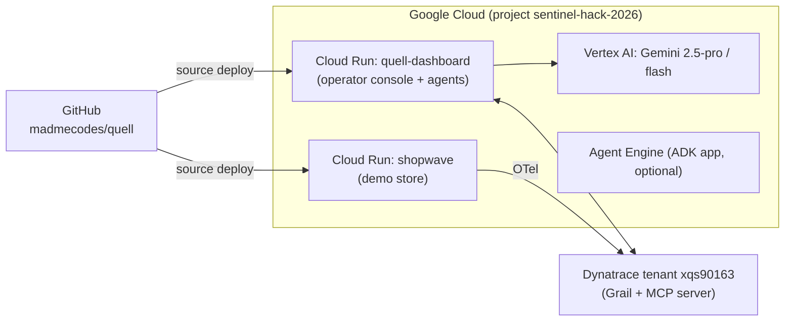

# Quell — Architecture

Quell is a multi-agent system that catches a degraded user experience in a live
app, traces the cause, quantifies the business impact, and prevents it — with a
human in the loop — then improves its own agents. These diagrams render on GitHub.

---

## 1. The big picture — two halves

The **patient** (ShopWave, a live store) emits telemetry. The **doctor** (Quell,
six AI agents) reads that telemetry through Dynatrace, reasons with Gemini, and acts.

---

## 2. The incident lifecycle (what happens, in order)

---

## 3. The orchestrated pipeline + the immutable Case File

One central orchestrator runs the agents in order. Each agent reads the shared
**Case File**, appends exactly one finding, and hands it on. Two human gates sit in
the flow. This is orchestration (one controller), not choreography (agents messaging
each other) — chosen for traceability and control.

---

## 4. Inside one agent — the genuine tool-calling loop

Watcher, Tracer and Judge are real tool-using agents. Gemini is given a catalog of
Dynatrace tools and decides which to call and when. The conclusion is grounded in
the actual tool results (never the model's free text), with a deterministic backfill
so the handoff never breaks.

---

## 5. The self-improvement loop (two human-gated channels)

The Evaluator runs *after* the rescue, off the hot path. It grades each agent from
its own Dynatrace traces and proposes improvements — applied only after the human
approves at Gate 2.

Two guardrails: the Evaluator runs on a **different model** than the agents it grades
(no self-preference bias), and **nothing is written to memory without the human gate**
(no self-poisoning).

---

## 6. Mock vs Live — the same agents, swappable backend

The agents call a typed tool surface. A factory returns either the mock backend
(deterministic, zero credentials — used for the demo) or the live Dynatrace client
(real OAuth token + async Grail DQL). The agents are identical either way.

---

## 7. Deployment topology

---

## The one-line summary

> ShopWave is the patient. Dynatrace is the senses. Gemini is the brain. The six
> agents are the medical team. You sign off twice — before the fix, and before the
> system changes itself.
