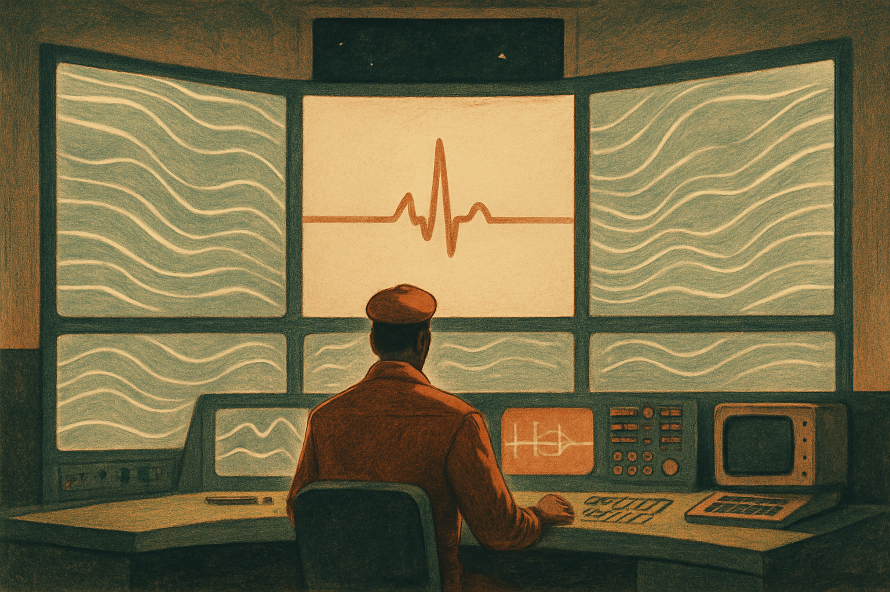
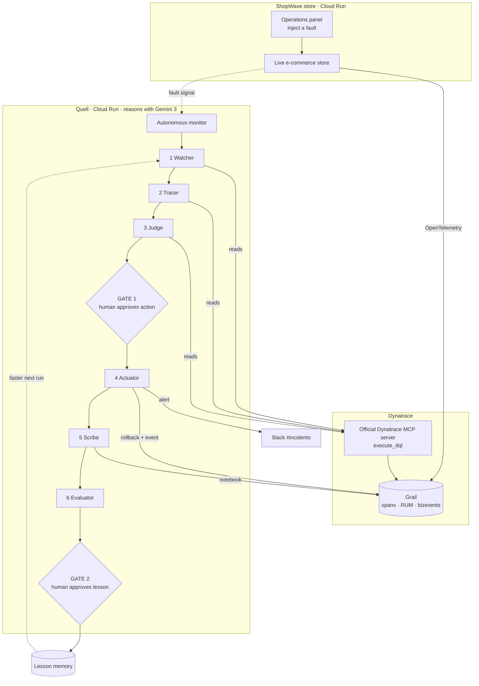
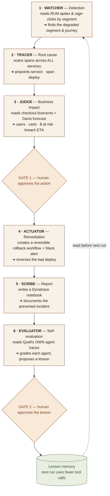
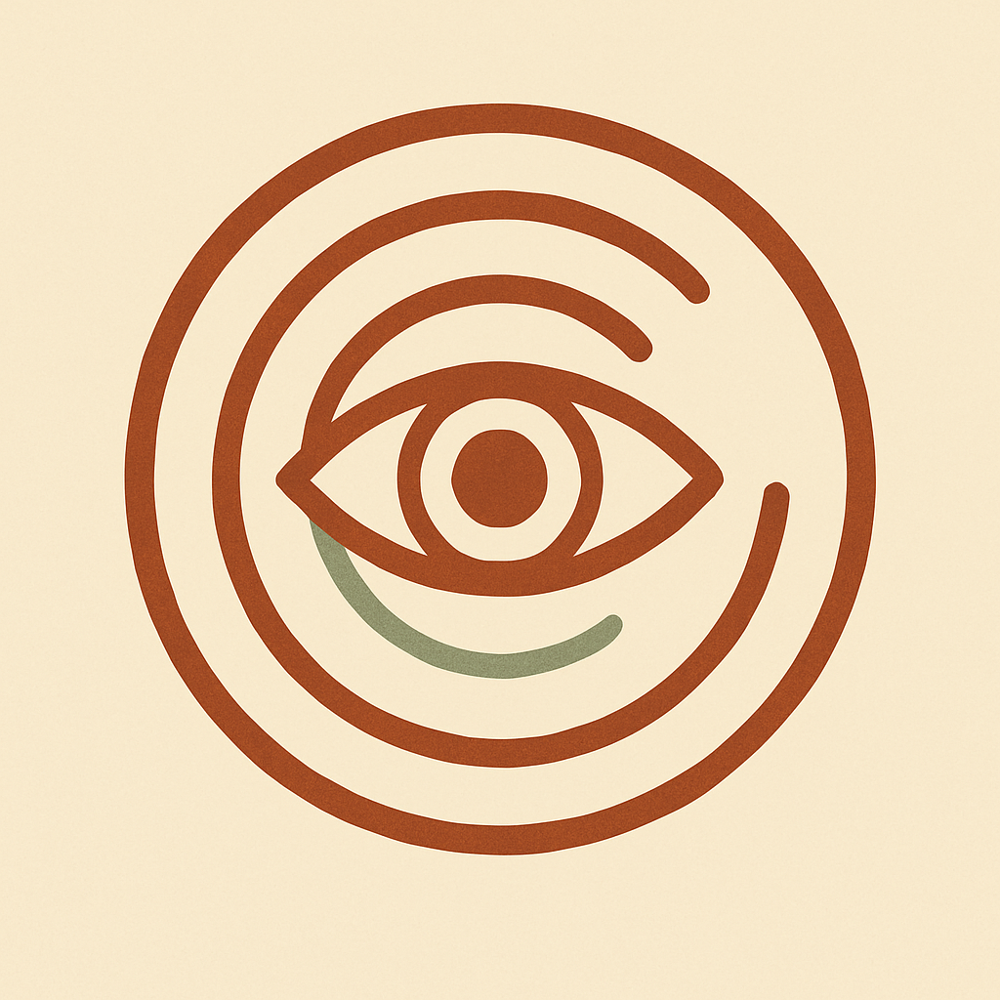
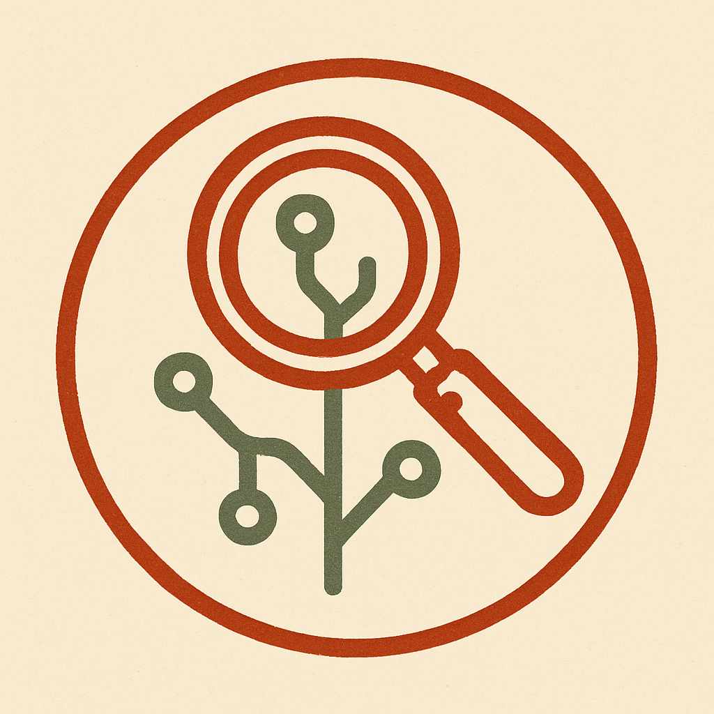
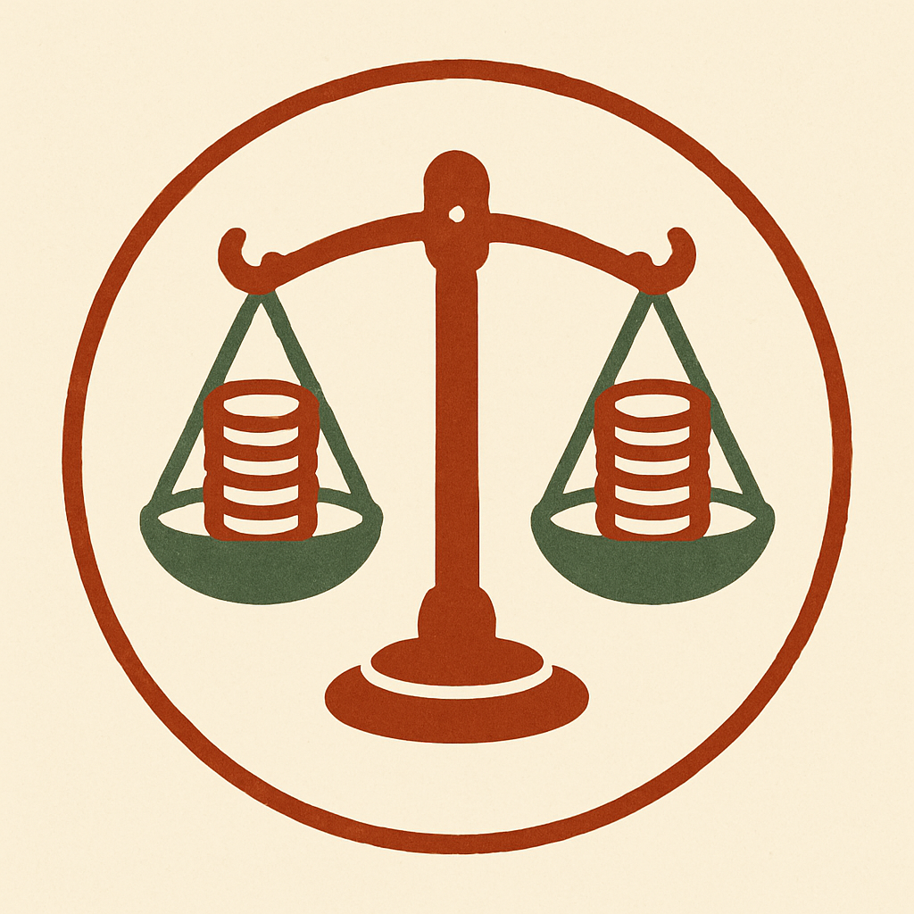
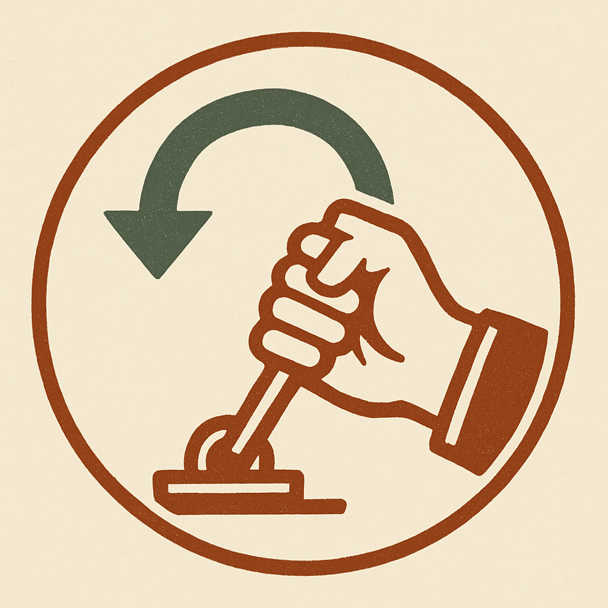
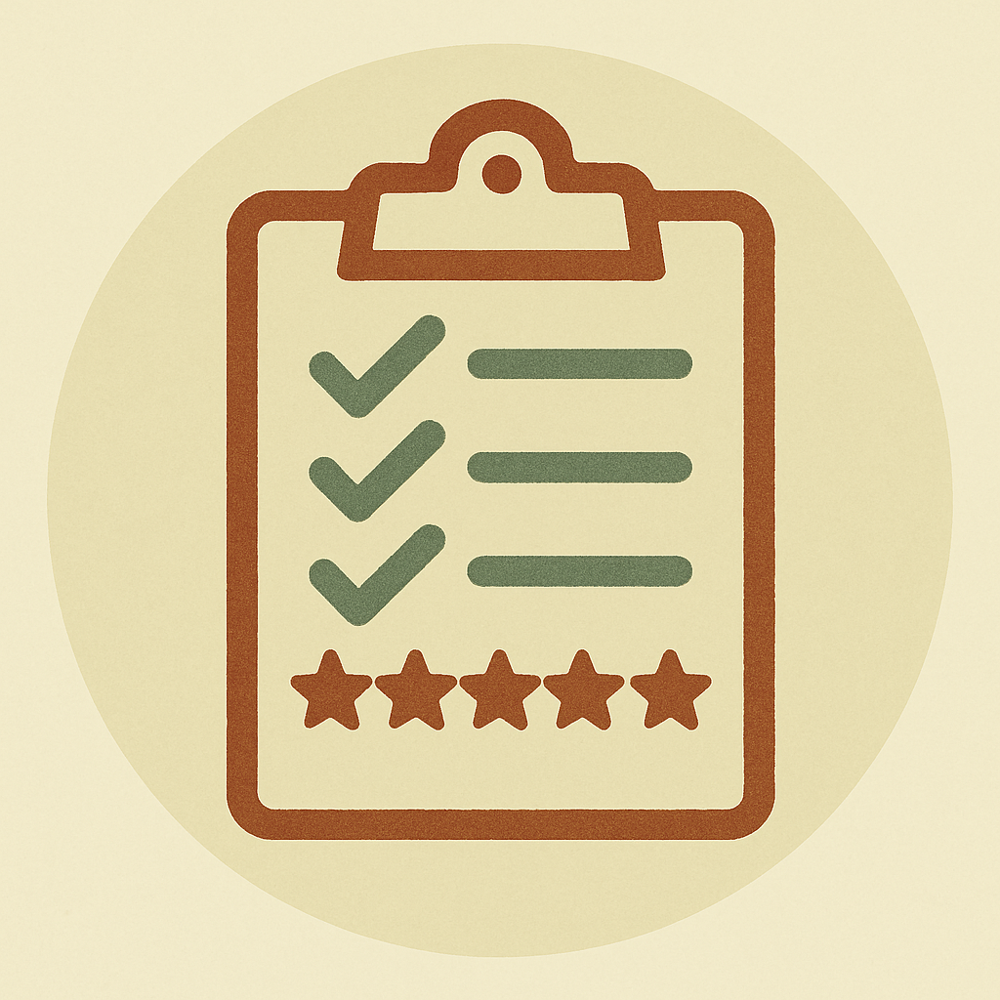
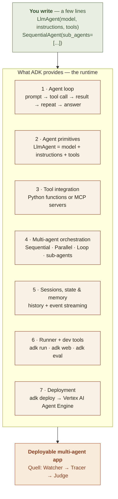

# Quell

<p align="center">
  
</p>

<p align="center"><i>Quell the incident before it spreads — six Gemini agents that watch a live store through Dynatrace, trace a failure, price it, and stop it.</i></p>

**Live**
- Quell console (hosted project): https://quell-dashboard-908906947513.us-central1.run.app
- ShopWave demo store: https://shopwave-908906947513.us-central1.run.app
- Source: https://github.com/madmecodes/quell

A multi-agent system that catches degraded real-user experience in a live app,
traces it to a root cause across the full stack, quantifies the business impact,
and prevents it -- with a human in control. It then grades its own agents from
their telemetry and improves them run over run.

Built for the Google Cloud Rapid Agent Hackathon, Dynatrace track. Powered by
Gemini on Google Cloud Agent Builder, with the Dynatrace MCP server as the
agents' senses and hands.

**The hosted console runs live**: it reads real Dynatrace Grail and reasons with
real Gemini (graceful fallback to a deterministic path if the tenant is sparse).

- **Five fault scenarios** -- slow payments, checkout errors, catalog slowdown, cart
  failures, external (Razorpay) outage. The agents *discover* the faulted service from
  telemetry (a cross-service scan), so each run is a genuinely different diagnosis, not
  a replayed script.
- **Autonomous** -- Quell continuously watches Dynatrace and launches the investigation
  itself the moment it detects an anomaly; you still approve the fix. A manual "Detect"
  button remains as an override.
- **Live observability in the console** -- sparkline charts (latency, apdex, revenue,
  error-budget) streamed from Grail, plus the *exact DQL* each agent ran shown inline.
- **Real action** -- the approved rollback creates a Dynatrace workflow + event and posts
  a prevented-incident summary to Slack.
- **Continuous traffic** -- ShopWave self-generates load so the tenant always has live data.

## Why Dynatrace is the core, not decoration

Quell acts on truth that exists only in live production telemetry: real users,
real sessions, real revenue, real traces. A failing checkout for Android users in
one region after this morning's deploy cannot be found by a unit test, a code
read, or a simulation -- only by Dynatrace. Remove Dynatrace and the agents are
blind. That is the bar the idea is built to clear.

## Architecture

### 1 · Whole system — ShopWave, Dynatrace (via MCP), and the six agents

A fault is injected on the live ShopWave store, which streams OpenTelemetry to
Dynatrace Grail. Quell's monitor detects it; the agents read Grail **through the
official Dynatrace MCP server** (`execute_dql`), reason with Gemini, and act
behind two human gates. Every action is written back to Dynatrace and Slack.



### 2 · What each agent does



## The agents

<p align="center">
  
  
  
  
  
  
</p>

| Agent | Job | Dynatrace tools | Access |
|-------|-----|-----------------|--------|
| Watcher | detect degraded real-user experience by segment | execute_dql (RUM), generate_dql_from_natural_language, list_problems | read |
| Tracer | pinpoint the failing service / span / deploy | execute_dql (spans), find_entity_by_name, list_exceptions, generate_dql_from_natural_language | read |
| Judge | quantify users, carts, revenue at risk; forecast breach | execute_dql (business events), list_davis_analyzers, execute_davis_analyzer | read |
| Actuator | execute the approved, reversible fix and notify | create_workflow_for_notification, send_event, send_slack_message | write |
| Scribe | write the prevented-incident report and seal the audit log | create_dynatrace_notebook, send_slack_message | write |
| Evaluator | grade every agent from its own traces; propose improvements | execute_dql (Quell's own spans) | read |

Tool scoping is the safety boundary: only Actuator and Scribe can write, and the
human approval gate sits immediately before the Actuator.

## How it works

```
Watcher -> Tracer -> Judge -> [GATE 1: human approves action] -> Actuator -> Scribe
                                                                              |
                                      Evaluator (async, reads own traces) ----+
                                                                              |
                                      [GATE 2: human approves learning] -> memory + definition edits
```

- Orchestration, not choreography: one central pipeline passes a single immutable
  Case File down the line. Every agent appends one finding; the Case File is the
  audit trail.
- Two human checkpoints: approve the action before anything touches production,
  and correct the evaluation before anything is written to memory.
- Self-improvement, two ways. Memory (Reflexion): a human-approved lesson is
  written to the agent's episodic store and read on the next run. Definition: the
  Evaluator recommends a concrete edit to the agent's instructions for the human
  to apply. The Evaluator runs on a different model than the agents it grades, to
  avoid self-preference bias.

## Genuine tool-calling agents

Watcher, Tracer, and Judge are real tool-using agents, not hardcoded sequences.
Each is handed a catalog of Dynatrace tools as callables; Gemini decides which to
call, in what order, and when it has enough to conclude (verified: it chooses a
different number of tool calls run to run). Two guardrails keep autonomy reliable:

- The conclusion is grounded in the verified tool results, not the model's free
  text, so a hallucinated span or deploy name never reaches downstream agents.
- If the model skips the tool that yields the structured handoff, `finalize`
  backfills it deterministically, so the pipeline never breaks.

When live LLM is off, the same agents run a deterministic path so the demo always
works. The deployable `quell_adk/` app expresses the same agents on Google ADK
with the official Dynatrace MCP server as the tool source.

## Built on Google's Agent Development Kit (ADK)

New to ADK? It is Google's open-source framework (`pip install google-adk`) for
building agents on Gemini. The mental model: **you declare _what_ each agent is;
ADK runs the _how_** — the tool-calling loop, the orchestration, the deployment.
That is why the whole `quell_adk/agent.py` is ~140 lines yet is a complete,
deployable multi-agent app:

```python
watcher = LlmAgent(model="gemini-3.1-pro-preview", instruction="...", tools=[dynatrace_mcp])
tracer  = LlmAgent(...)
judge   = LlmAgent(...)
root_agent = SequentialAgent(sub_agents=[watcher, tracer, judge])
```



What ADK gives you (the plumbing you would otherwise hand-write):

1. **Agent loop** — you call one function; ADK runs the whole loop: prompt → model says "call tool X" → ADK executes the tool → feeds the result back → repeats → returns the final answer.
2. **Agent primitives** — `LlmAgent` = model + instructions + tools. That is the entire definition of an agent.
3. **Tool integration** — wrap a Python function or an MCP server (`MCPToolset`) as tools; ADK auto-generates the schemas, calls them, and parses the results.
4. **Multi-agent orchestration** — `SequentialAgent`, `ParallelAgent`, `LoopAgent`, and sub-agents compose agents into workflows without writing the coordination.
5. **Sessions, state & memory** — conversation history, session state, and event streaming are managed for you.
6. **Runner + dev tools** — `adk run` (CLI), `adk web` (a local chat UI to test the agent), `adk eval` (evaluation harness).
7. **Deployment** — `adk deploy agent_engine` ships it to **Vertex AI Agent Engine** (managed, autoscaled). This is the "Agent Builder" runtime the hackathon asks for.

## Run the demo (no credentials needed)

The pipeline runs end-to-end in mock mode against a simulated ShopWave store, so
the architecture is verifiable without a Dynatrace tenant or a Gemini key.

```
cd agents
python3 run_demo.py
```

It injects a fault via the Chaos Panel, runs both gates, prevents the incident,
then shows Tracer learning: same fault, fewer steps, higher score on the second
run.

## Full system

```bash
./run_all.sh        # ShopWave store :8080 (Chaos Panel) + Quell console :8090
```

Open the ShopWave store, inject a fault from the Chaos Panel, then run a detection
on the Quell console and approve the two gates. See `DEPLOY.md` for the live
paths (real Gemini reasoning, real Dynatrace reads, ingest token) and Agent Engine
deployment.

## Going live

Every backend is wired and verified; live mode is a flag flip:

- `QUELL_USE_LIVE_LLM=true` -> agents reason with Gemini on Vertex AI.
- `QUELL_USE_LIVE_DT=true` -> agents read real Grail data via `live_client`
  (token + async DQL), instead of the mock. Same method surface, so agents are
  unchanged.
- `quell_adk/` is the same architecture as a Google ADK app that uses the
  official Dynatrace MCP server for tools; deploy it to Vertex AI Agent Engine.

Quell instruments its own agents with OpenTelemetry (`otel_trace.py`); those
spans land in the same Dynatrace tenant, which is how the Evaluator grades agents
from their real traces.

## Layout

```
agents/
  quell/
    case_file.py        immutable, append-only Case File (the audit trail)
    memory.py           episodic lesson store (Reflexion-style learning)
    orchestrator.py     central pipeline + the two human gates
    config.py           model + live-mode config (.env auto-loaded)
    llm.py              Gemini reasoning layer (Vertex), deterministic fallback
    otel_trace.py       Quell's own agent spans -> Dynatrace (self-observability)
    dynatrace/
      mock_mcp.py       simulated ShopWave world + Chaos Panel (default)
      live_client.py    real Dynatrace: OAuth token + async Grail DQL + writes
      factory.py        pick mock vs live at runtime
      tools.py          per-agent tool scoping (the safety boundary)
    agents/             watcher, tracer, judge, actuator, scribe, evaluator
  run_demo.py           end-to-end mock run with the learning loop
  quell_adk/         ADK app: Gemini + official Dynatrace MCP server (deployable)
shopwave/               demo store: OTel traces + bizevents, traffic gen, Chaos Panel
dashboard/              operator console: the two gates, live rescue, scorecard
run_all.sh              launch ShopWave + dashboard
DEPLOY.md               live wiring + Agent Engine deployment
```
